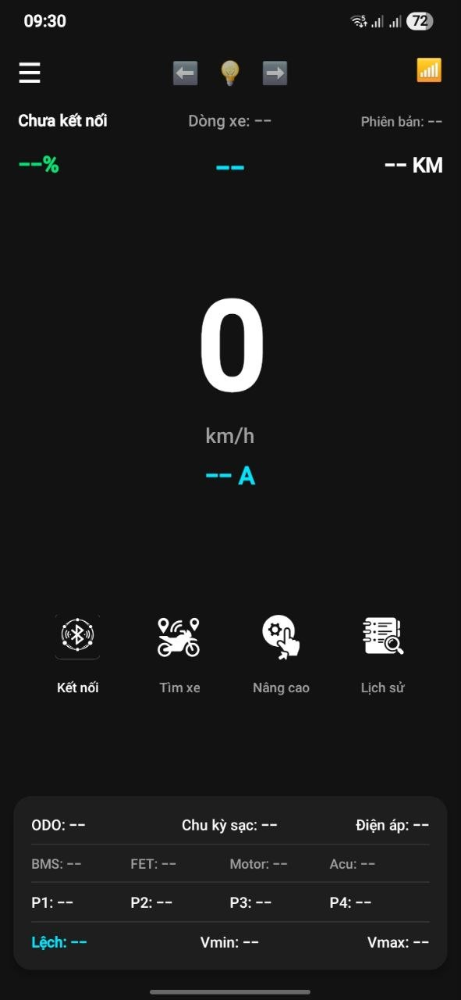
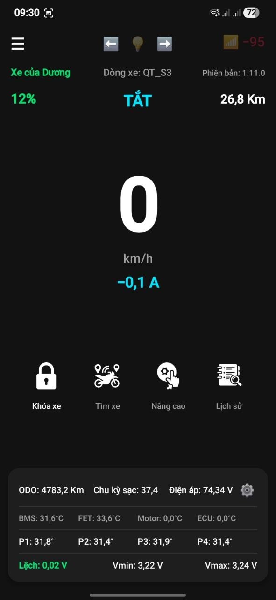
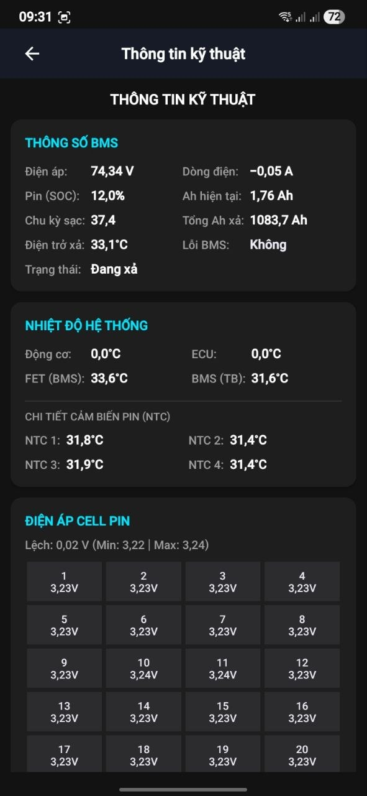
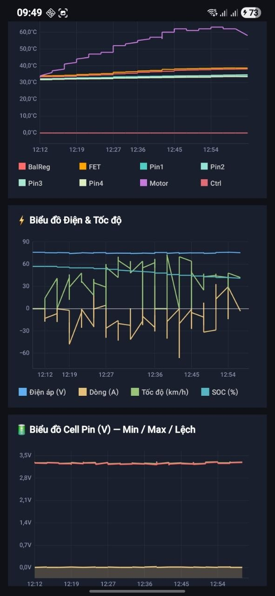

# DTC Bike - Datbike Telemetry Monitor

Ứng dụng hỗ trợ theo dõi thông số kỹ thuật chuyên sâu cho các dòng xe Datbike thông qua kết nối Bluetooth Low Energy (BLE).

## 📝 Mô tả ứng dụng
DTC Bike tập trung vào việc khai thác và hiển thị dữ liệu thời gian thực từ hệ thống quản lý của xe (Telemetry). Ứng dụng cho phép người dùng nắm bắt tình trạng vận hành của xe một cách minh bạch và chi tiết:

* **Thông số vận hành:** Theo dõi ODO (tổng quãng đường), tốc độ hiện tại và quãng đường dự kiến còn lại.
* **Hệ thống Pin:** Hiển thị chi tiết điện áp từng Cell pin (23 cells), độ lệch điện áp (Cell Diff), nhiệt độ các cảm biến NTC và số chu kỳ sạc (Cycles).
* **Dữ liệu kỹ thuật:** Giám sát nhiệt độ động cơ (Motor), bộ điều khiển (Controller), công suất tiêu thụ và trạng thái các cảm biến tay ga (ADC).
* **Nhật ký hành trình:** Lưu trữ lịch sử thông số để theo dõi hiệu suất xe theo thời gian.

*(Lưu ý: Phiên bản hiện tại tập trung hoàn toàn vào việc giám sát thông tin, không bao gồm các tính năng điều khiển hay can thiệp vào hệ thống xác thực của xe).*

---

## 🛠 Hướng dẫn Build Project

Dành cho các nhà phát triển muốn tự đóng gói ứng dụng:

1.  Khởi tạo project và Gradle:
    ```bash
    gradle wrapper
    ```

2.  Sử dụng các script hỗ trợ:
    * `./build_all.sh`: Dọn dẹp bộ nhớ đệm và build toàn bộ dự án để kiểm tra lỗi biên dịch.
    * `./build_release.sh`: Biên dịch và đóng gói ứng dụng thành file APK bản chính thức (Release), sẵn sàng để cài đặt lên điện thoại.
    * `./import_icons.sh`: Tự động hóa quá trình đưa các tài nguyên icon vào đúng thư mục hệ thống của Android project.

---

## 📲 Hướng dẫn cài đặt (Dành cho người dùng)

Nếu bạn không có khả năng tự build code, bạn có thể tham gia vào danh sách thử nghiệm nội bộ:

1.  **Đăng ký:** Các bác vui lòng gửi email cho tác giả qua tin nhắn tại Facebook: [https://www.facebook.com/hacrot3000](https://www.facebook.com/hacrot3000). Mình sẽ add email của các bác vào danh sách test app chính thức.
2.  **Tải ứng dụng:** Sau khi nhận được thông báo đã được thêm vào danh sách, các bác có thể:
    * Tải và cập nhật ứng dụng từ Google Play Store tại đường dẫn: [https://play.google.com/apps/internaltest/4701635252669113712](https://play.google.com/apps/internaltest/4701635252669113712).
    * Hoặc tải file [APK trực tiếp từ website](https://www.chuongduong.net/link/17057) mà không cần đăng ký.

## 📸 Ảnh chụp màn hình

| Chưa kết nối | Màn hình chính |
|:---:|:---:|
|  |  |
| **Thông số Pin & Kỹ thuật** | **Lịch sử & Biểu đồ** |
|  |  |

---
*Phát triển bởi Dương (DTC).*